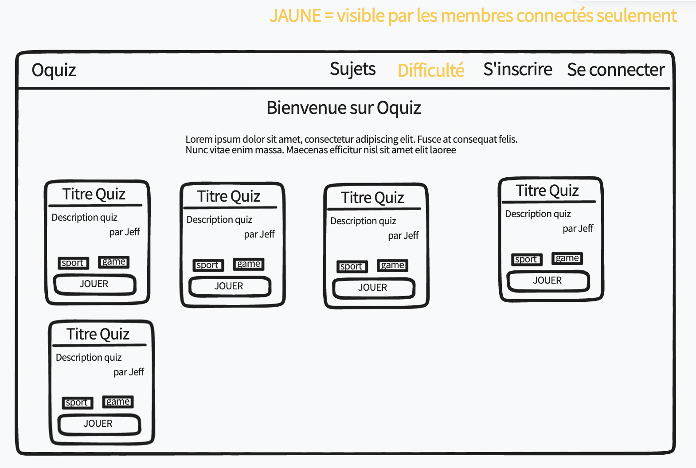

# Wireframes

## Kesako

Une maquette **fonctionnelle** d'une page, parfois en plusieurs exemplaires
Fonctionnelle = on comprend les actions possibles (pas forcement clickable)

Objectif : 
- comprendre globalement les actions possibles de l'utilisateur sur cette page. 
- clarifier le besoin, avoir un retour rapide sur le prototype (sinon : "Ah bah c'est très beau ton truc mais c'est pas ça que je voulais")

Attention : pas besoin d'être joli, simplement fonctionnel, ou on comprends 

## Outils pour en créer

### Les armes de poing

- ⚠️ papier et un crayon
- une ardoise / whiteboard
- tldraw
- excalidraw
- draw.io
- whiteboard
- wireframe.cc

### L'artillerie lourde

- Figma
- Adobe XD
- Photoshop

### Objectif 

En atelier ce soir, si vous avez le temps et que vous vous ennuyez, n'hésitez pas à faire un wireframe pour la page de votre choix pour pratiquer l'outil de votre choix : 
- page de connexion
- page d'inscription
- page d'un quiz
- page des thèmes
- page des difficultés (admin)
- page du résultat d'un quiz

### Exemples 

#### Page d'accueil

